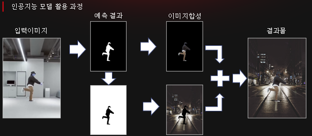
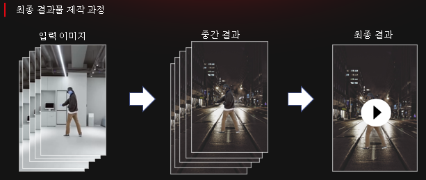
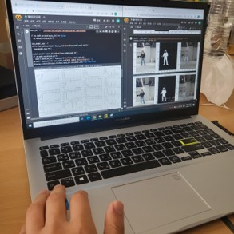

# StopMotion Project(팀 프로젝트)[Layer UNET]

## 전체 프로세스

최종 결과물들을 활용해 FPS와 프레임 수를 조절 하며 적절히 스탑모션 영상의 느낌을 재현

## 모델

사용 모델 : [LayerUNET](https://velog.io/@pre_f_86/Layer-UNET)

## 파일 설명

- training.ipynb : 모델 학습 파이프라인

- videoslice.ipynb : 비디오파일을 이미지로 전환하는 전처리, 스탑모션 영상 제작

--- 

